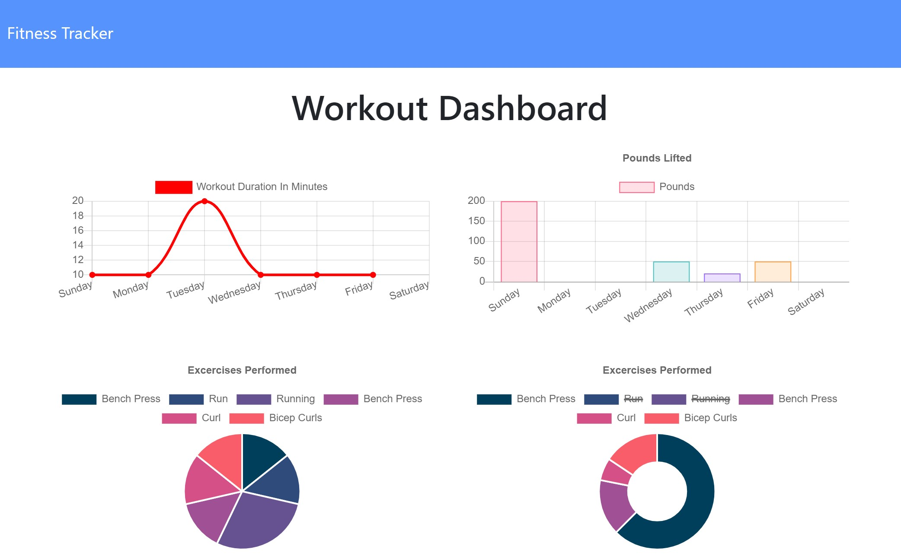

# Fitness Tracker
https://gentle-taiga-88197.herokuapp.com/

## Description
This workout tracker utilizes express and mongoose to log a user's workout routine and progress, helping them reach their fitness goals quicker. Users can create and track their daily workouts composed of multiple exercises throughout the day. For each exercise, you may specify the type, name, weight, sets, reps, and duration of the exercise (specify the distance if it is cardio). The main page allows users to create a new workout or continue the last workout, and the stats dashboard will display the past week's workout data using graphs and charts for simple and user-friendly visual tracking.

## License
This project is licensed under the MIT license.

## Questions
If you have any questions about this repo, please open an issue or contact mykakugaya directly at mykakug129@gmail.com.

## Screenshot
